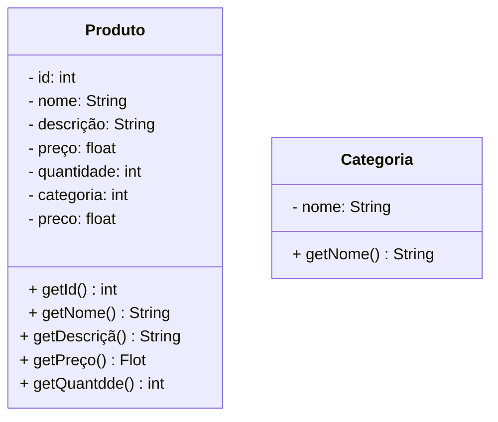

# Projeto Farmácia (e-commerce) - Java


<br />


<div align="center">

&nbsp;	

</div>

<br />


<div align="center">

&nbsp; 

&nbsp; 

&nbsp; 

&nbsp; 

&nbsp; 

&nbsp; 

&nbsp; 


</div>


------


<br />


\## 1. Descrição


<br />


O \*\*Projeto Farmácia (e-commerce)\*\* é um sistema de gestão desenvolvido para simular e administrar operações comuns em uma Farmácia virtual. Oferece funcionalidades como \*\*cadastro\*\*, \*\*consulta\*\*, \*\*atualização\*\* e \*\*remoção\*\* de produtos.


O sistema organiza as informações dos produtos — incluindo nome, preço e categoria — garantindo uma experiência de compra segura e eficiente. Seu principal objetivo é automatizar e simplificar o gerenciamento de uma loja online, promovendo agilidade, controle e eficiência no atendimento ao cliente.


Este projeto, desenvolvido em \*\*Java\*\*, foca no estudo e aplicação dos conceitos de \*\*Programação Orientada a Objetos (POO)\*\*, incluindo:


\- Classes e Objetos;

\- Atributos e Métodos;

\- Modificadores de Acesso;

\- Herança e Polimorfismo;

\- Classes Abstratas;

\- Interfaces.


Além de servir como um simulador funcional, o projeto oferece uma base prática para compreender os princípios fundamentais da POO aplicados a um cenário realista.


<br />


\## 2. Funcionalidades do Projeto


<br />


1\. \*\*Cadastrar Produto:\*\* Adiciona um novo produto ao sistema especificando nome, preço, categoria e demais propriedades relevantes. O identificador do produto é gerado automaticamente.

2\. \*\*Listar todos os Produtos:\*\* Exibe todos os produtos cadastrados no sistema, com informações detalhadas.

3\. \*\*Consultar Produto por ID:\*\* Localiza um produto específico a partir do seu identificador único.

4\. \*\*Editar Produto:\*\* Permite atualizar os dados de um produto existente com base no seu ID.

5\. \*\*Excluir Produto:\*\* Remove um produto específico do sistema a partir do seu ID.


<br />


\## 3. Diagrama de Classes


<br />


Um \*\*Diagrama de Classes\*\* é um modelo visual usado na programação orientada a objetos para representar a estrutura de um sistema. Ele exibe classes, atributos, métodos e os relacionamentos entre elas, como associações, heranças e dependências.


Esse diagrama ajuda a planejar e entender a arquitetura do sistema, mostrando como os componentes interagem e se conectam. É amplamente utilizado nas fases de design e documentação de projetos.


Abaixo, você confere o Diagrama de Classes do Projeto Farmácia (e-commerce):





<br />


\## 4. Tela Inicial do Sistema - Menu


<br />


<div align="center">

&nbsp;  

</div>


<br />


\## 5. Requisitos


<br />


Para executar os códigos localmente, você precisará de:


\- \[Java JDK 17+](https://www.oracle.com/java/technologies/javase/jdk17-archive-downloads.html)

\- \[Eclipse](https://eclipseide.org/) ou \[STS](https://spring.io/tools)


<br />


\## 6. Como Executar o projeto no Eclipse/STS


<br />


\### 6.1. Importando o Projeto


1\. Clone o repositório do Projeto \[Farmácia](https://github.com/crissmcoelho/farmacia) dentro da pasta do \*Workspace\* do Eclipse/STS


```bash

git clone https://github.com/crissmcoelho/farmacia.git

```


2\. \*\*Abra o Eclipse/STS\*\* e selecione a pasta do \*Workspace\* onde você clonou o repositório do projeto

3\. No menu superior do Eclipse/STS, clique na opção: \*\*File 🡲 Import...\*\*

4\. Na janela \*\*Import\*\*, selecione a opção: \*\*General 🡲 Existing Projects into Workspace\*\* e clique no botão \*\*Next\*\*

5\. Na janela \*\*Import Projects\*\*, no item \*\*Select root directory\*\*, clique no botão \*\*Browse...\*\* e selecione a pasta do Workspace onde você clonou o repositório do projeto

6\. O Eclipse/STS reconhecerá automaticamente o projeto

7\. Marque o Projeto Conta Bancária no item \*\*Projects\*\* e clique no botão \*\*Finish\*\* para concluir a importação


<br />


\### 6.2. Executando o projeto


1\. Na guia \*\*Package Explorer\*\*, localize o Projeto Conta Bancária

2\. Abra a \*\*Classe Menu\*\*

3\. Clique no botão \*\*Run\*\*  para executar a aplicação

4\. Caso seja perguntado qual é o tipo do projeto, selecione a opção \*\*Java Application\*\*

5\. O console exibirá o menu do Projeto.


<br />


\## 7. Contribuição


<br />


Este repositório é parte de um projeto educacional, mas contribuições são sempre bem-vindas! Caso tenha sugestões, correções ou melhorias, fique à vontade para:


\- Criar uma \*\*issue\*\*

\- Enviar um \*\*pull request\*\*

\- Compartilhar com colegas que estejam aprendendo Java!


<br />


\##  8. Contato


<br />


Desenvolvido por \[\*\*Cristina Martins Coelho\*\*](https://github.com/crissmcoelho)

Para dúvidas, sugestões ou colaborações, entre em contato via GitHub ou abra uma issue!

